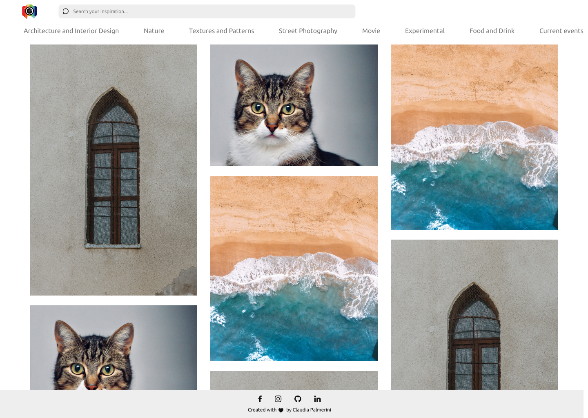
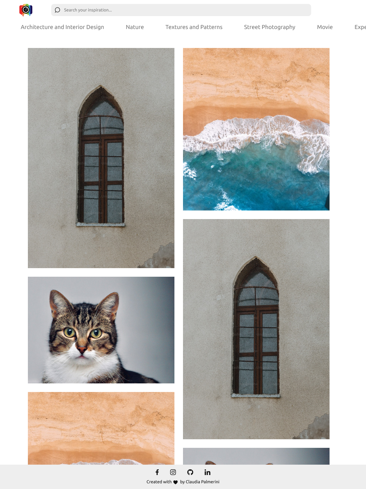
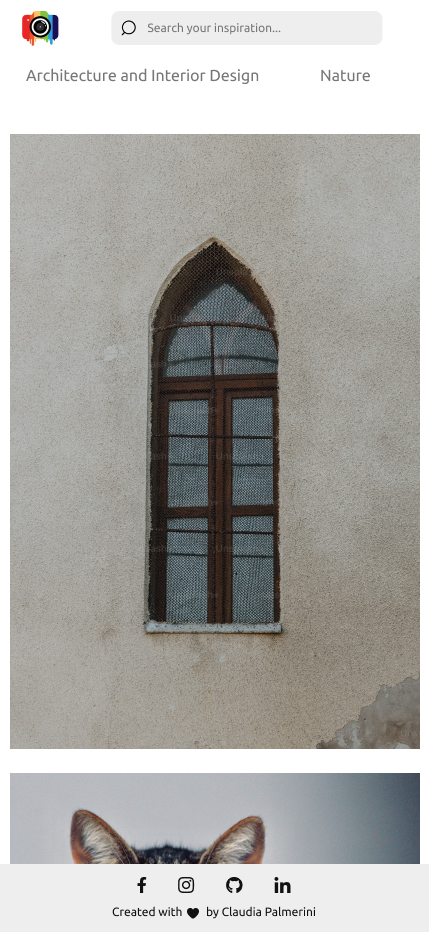
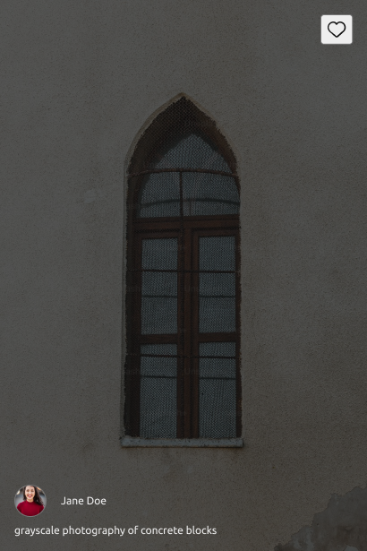

# Project 3 - JS ASYNC - Inspiration-bp

This is a mix copy between pinterest and unsplahs, a website where you can find inspiration...

## Accceptance criteria

- [x] In this project, we will need to replicate, more or less, the web application Pinterest.
- [x] The layout of the web application can be a replica of the original, similar to the example, or even an original rebranding by your team.
- [x] Everything must be created with VITE, using modular styles, and componentizing each part of the application.
- [x] Unsplash has an official JavaScript client that allows us to make up to 50 daily requests by providing our API_KEY. To use it, we will install unsplash-js as a dependency: `npm install unsplash-js`
- [x] This application should allow us to search for the entered query in the input and display the corresponding images using the Unsplash API. Any additional functionality beyond the basic requirements will be appreciated.

## Implementation

- The project is mix replica between pinterest and unsplash website
- Laoding the first time the page it will show some random pictures
- Possibility to search by input photos releated to a topic
- Possibility to chose some categories to show releated photos
- I impletented a mansory layout
- I impletemented a infinite scrolling to show to the user more than 10 pictures
- The website is fully responsive

## Figma design:

### Desktop:

### Tablet:

### Mobile:

### Card hover:

